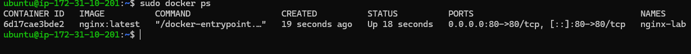
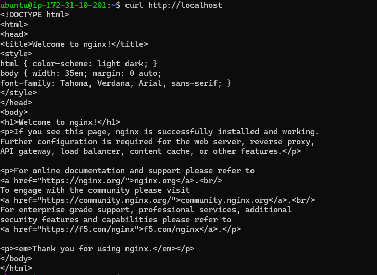
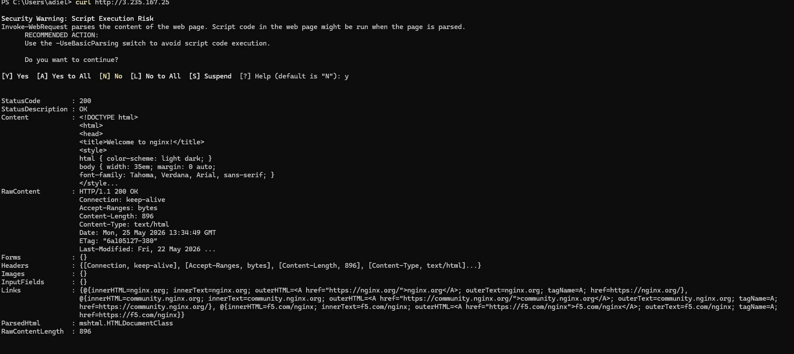
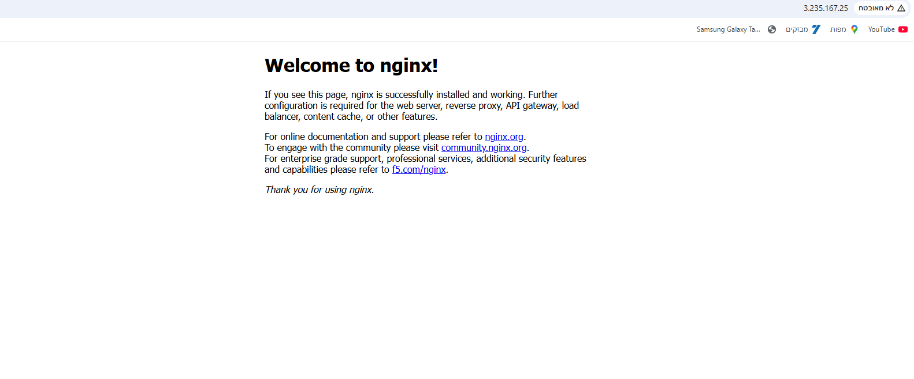

# AWS EC2 & Docker Nginx Lab

## Objective
Deployment of an Nginx web server inside a Docker container hosted on an AWS EC2 Ubuntu instance.

## Deployment & Validation

### 1. Container Execution
The Nginx container was successfully deployed on the EC2 host. Port mapping was established to forward traffic from the host's port 80 to the container's port 80.

### 2. Internal Network Validation
The container's availability was verified from within the EC2 instance using a local loopback request.

### 3. External Access Validation (CLI)
To confirm the AWS Security Group allows inbound HTTP traffic, a remote request was executed from a local PowerShell client to the EC2 instance's public IP address.

### 4. External Access Validation (Browser)
The Nginx welcome page accessed successfully via a web browser over the public internet.

